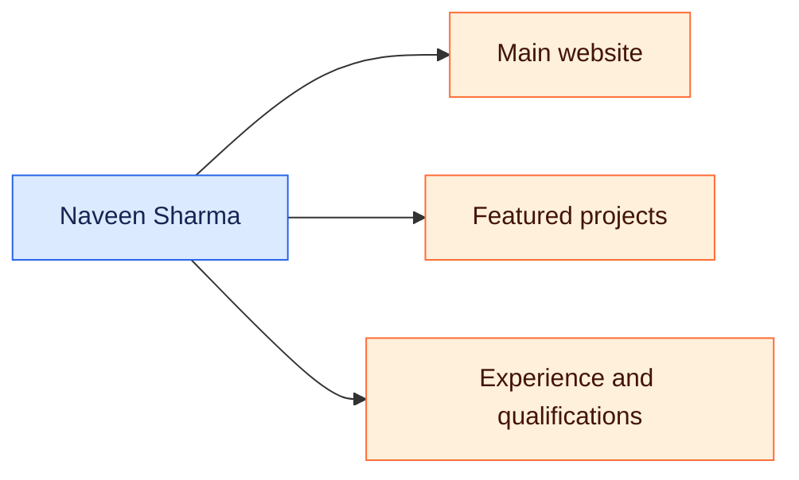

<h1 align="center">Naveen Sharma</h1>

  <strong>AI Automation &amp; Integration Engineer · SaaS Implementation Specialist · Workflow Automation</strong>

[Portfolio](https://naveensharma.net) · [LinkedIn](https://www.linkedin.com/in/naveensharmatech/) · [Opility](https://opility.com)

Based in Be’er Sheva, Israel. I combine SaaS implementation, technical operations, and QA experience with hands-on projects in automation, AI assistants, integrations, and web data extraction.

I build with no-code tools and AI assistance, focusing on useful workflows, clear documentation, and checking how systems behave.

[What I work on](#section-1) · [Featured projects](#section-2) · [Experience](#section-3) · [Education & completed learning](#section-4)

### 🗺️ Visual overview

A visual guide to the project and the documentation below.

---

## What I work on

- Workflow automation, routing, and connected business tools
- SaaS configuration, onboarding, forms, and data mapping
- API integrations, webhooks, and document workflows
- Functional testing, regression testing, and QA/UAT
- AI-assisted websites, assistants, and data extraction projects

## Featured projects

| Project | Purpose | Explore |
| --- | --- | --- |
| Customer Inquiry Router | Inquiry classification, CRM updates, and email routing | [Source & setup](https://github.com/naveensharmatech/customer-inquiry-router-zapier) |
| B2B Lead Generator | Business discovery and public contact extraction | [Apify actor](https://apify.com/opility/b2b-leads-scraper-1-5-1k-leads-emails-phones) |
| Shopify Store Lead Extractor | Public store contacts, catalog signals, and app detection | [Apify actor](https://apify.com/opility/shopify-store-lead-extractor-emails-catalog-size-apps) |
| Professional Portfolio | React website with work demonstrations, certificates, and Ella, my personal assistant | [Website](https://naveensharma.net) · [Source](https://github.com/naveensharmatech/portfolio) |

My portfolio also includes a Django Blogging CMS academic project, QA test plans, and additional automation learning projects.

## Experience

- **Bolt Healthcare:** SaaS implementation, workflow configuration, document automation, and QA/UAT.
- **Shivam Institute:** Franchise ownership, academy administration, technical operations, and lab coordination.
- **Vishay Intertechnology:** Manufacturing process operations and quality control.

[Explore experience and work demonstrations](https://naveensharma.net/#experience)

## Education & completed learning

- Bachelor of Computer Applications — Amity University Online
- Zapier Academy — AI Agent, MCP, and Account Admin Essentials paths
- QA Manual & Automation — Smart College and Great Learning Academy
- JSM Fundamentals with AI and Jira Service Management course badges — Atlassian
- AI Tools Workshop — be10x
- Customer Relationship Management — HP LIFE

[View qualifications and certificate evidence](https://naveensharma.net/#qualifications)

## Connect

Open to remote roles that can hire in Israel, suitable local hybrid roles, B2B contracts, and freelance projects.

[Contact me](https://naveensharma.net/#contact) · [Business enquiries through Opility](https://opility.com)
